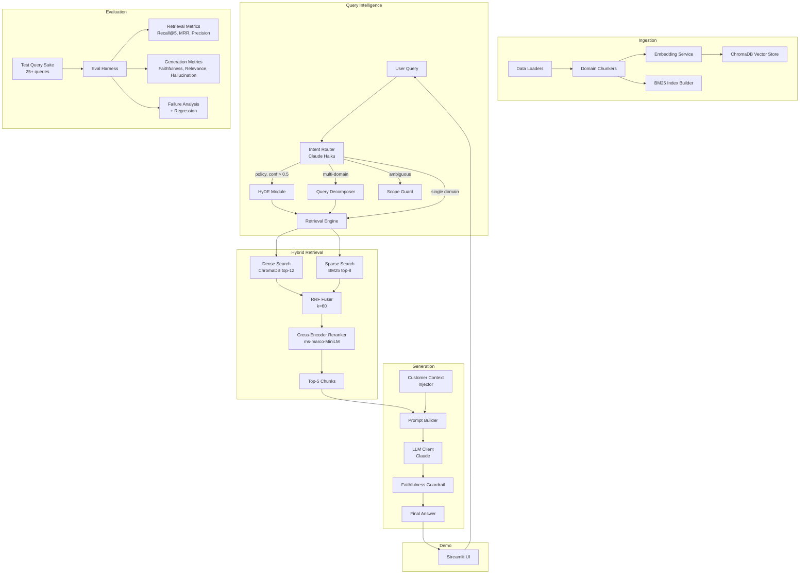
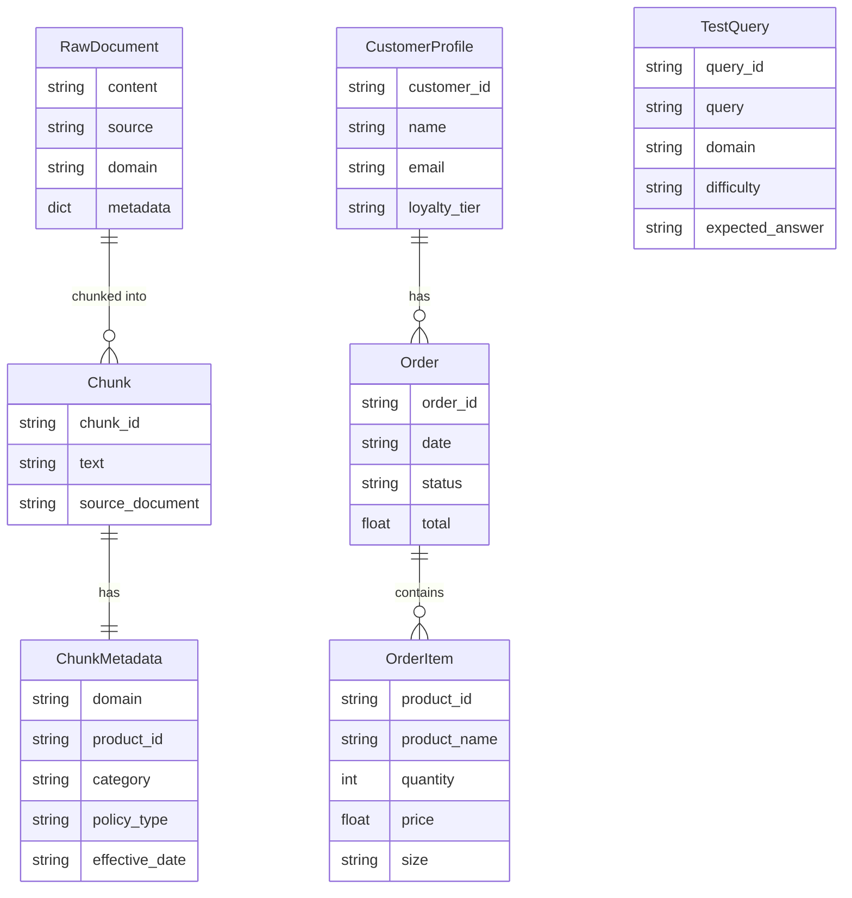

# Design Document: ALO RAG System

## Overview

This design describes a production-grade Retrieval-Augmented Generation (RAG) system for ALO Yoga that enables natural language querying across three knowledge domains: product knowledge, policy & operations intelligence, and customer context. The system is a proof-of-concept interview case study demonstrating advanced RAG techniques.

The architecture follows a pipeline pattern: **Ingestion → Query Intelligence → Hybrid Retrieval → Generation → Evaluation**. Each stage is a discrete, testable module with structured trace output. Key design decisions include per-domain chunking strategies, hybrid dense+sparse retrieval with RRF fusion and cross-encoder reranking, an LLM-based intent router, HyDE for policy queries, structured (non-embedded) customer data lookup, and a faithfulness guardrail.

**Technology Stack:**
- Python 3.12+
- Anthropic Claude (generation + intent routing via claude-haiku-4-5)
- ChromaDB (vector store)
- rank-bm25 (sparse retrieval)
- Voyage AI voyage-3 (primary embeddings), sentence-transformers/all-mpnet-base-v2 (fallback)
- sentence-transformers cross-encoder/ms-marco-MiniLM-L-6-v2 (reranker)
- Streamlit (demo UI)
- RAGAS / DeepEval (evaluation metrics)

## Architecture

The system is organized into five major subsystems connected by a pipeline orchestrator. Each subsystem is independently testable and emits structured trace data.



### Pipeline Orchestrator

A central `Pipeline` class coordinates the query flow:

1. Receive query + optional customer_id from the Demo UI or API
2. Call Intent Router → get domain classifications with confidence scores
3. If ambiguous (all scores < 0.3) → Scope Guard evaluation
4. If policy domain with confidence > 0.5 → activate HyDE
5. If multi-domain (2+ domains > 0.3) → Query Decomposer splits into sub-queries
6. For each (sub-)query → Hybrid Retrieval (dense + sparse → RRF → rerank → top-5)
7. If customer_id provided → Customer Context Injector fetches order data
8. Prompt Builder assembles context → LLM generates answer
9. Faithfulness Guardrail verifies claims
10. Return answer + trace log

Each step appends to a `TraceLog` dataclass that captures timing, inputs, outputs, and decisions.

## Components and Interfaces

### 1. Ingestion Pipeline (`src/ingestion/`)

#### Data Loaders (`loaders.py`)

```python
@dataclass
class RawDocument:
    content: str
    source: str
    domain: str  # "product", "policy", "customer"
    metadata: dict[str, Any]

class ProductLoader:
    """Loads product catalog from JSON files."""
    def load(self, path: Path) -> list[RawDocument]: ...

class PolicyLoader:
    """Loads policy documents from markdown/text files."""
    def load(self, path: Path) -> list[RawDocument]: ...

class CustomerLoader:
    """Loads customer order data from JSON/CSV for structured lookup."""
    def load(self, path: Path) -> dict[str, CustomerProfile]: ...
```

#### Domain Chunkers (`chunkers.py`)

```python
@dataclass
class Chunk:
    chunk_id: str
    text: str
    metadata: ChunkMetadata
    source_document: str

@dataclass
class ChunkMetadata:
    domain: str  # "product" | "policy"
    product_id: str | None
    category: str | None
    fabric_type: str | None          # e.g. "Airlift", "Airbrush", "Alosoft" — enables cross-product fabric queries
    policy_type: str | None  # "returns" | "shipping" | "promo" | "loyalty"
    effective_date: str | None

class ProductChunker:
    """One chunk per product. Concatenates all product fields into a single chunk."""
    def chunk(self, doc: RawDocument) -> list[Chunk]: ...
    def _validate_product(self, product: dict) -> bool:
        """Returns True iff product contains non-empty values for product_id, name,
        and description. Logs a structured warning on failure:
        {"level": "warning", "stage": "product_chunker",
         "missing_field": <field>, "record_index": <n>}
        """
        ...

class PolicyChunker:
    """Semantic section-based chunking. Preserves conditional logic blocks."""
    def chunk(self, doc: RawDocument) -> list[Chunk]: ...
    def _detect_section_boundaries(self, text: str) -> list[tuple[int, int]]: ...
    def _contains_complete_conditionals(self, text: str) -> bool: ...
```

**Design Decision — Per-domain chunking:** Products are chunked one-per-product because product queries need complete product context. Policy documents are chunked at semantic section boundaries (headings, topic shifts) to preserve conditional logic (if/then/else rules for returns, promos, etc.). Fixed-size chunking would risk splitting a conditional clause across chunks, degrading retrieval quality for policy questions.

#### Embedding Service (`embedders.py`)

```python
class EmbeddingService:
    """Computes dense embeddings with primary/fallback model support."""
    def __init__(self, primary_model: str = "voyage-3",
                 fallback_model: str = "all-mpnet-base-v2"): ...
    def embed(self, texts: list[str]) -> list[list[float]]: ...
    def embed_single(self, text: str) -> list[float]: ...
    def _try_primary(self, texts: list[str]) -> list[list[float]] | None: ...
    def _use_fallback(self, texts: list[str]) -> list[list[float]]: ...
```

#### Index Builder (`index_builder.py`)

```python
@dataclass
class IndexBuildResult:
    chunks_indexed: int
    chunks_skipped: int  # validation failures

class IndexBuilder:
    """Orchestrates building both ChromaDB and BM25 indexes from chunks."""
    def __init__(self, vector_store: VectorStore, bm25_builder: BM25Builder): ...
    def build(self, chunks: list[Chunk]) -> IndexBuildResult: ...

class VectorStore:
    """ChromaDB wrapper for dense vector storage and retrieval."""
    def __init__(self, collection_name: str = "alo_rag"): ...
    def add(self, chunks: list[Chunk], embeddings: list[list[float]]) -> None: ...
    def query(self, embedding: list[float], n_results: int = 12,
              metadata_filter: dict | None = None) -> list[RetrievedChunk]: ...
    def verify_chunk(self, chunk_id: str, expected_text: str) -> bool:
        """Round-trip integrity check (R3.5). Retrieves stored document text
        by chunk_id and returns True iff it matches expected_text exactly."""
        ...

class BM25Builder:
    """Builds and persists a BM25 index from chunk texts."""
    def build(self, chunks: list[Chunk]) -> BM25Index: ...

class BM25Index:
    """Wrapper around rank-bm25 for sparse retrieval."""
    def query(self, query_text: str, n_results: int = 8) -> list[RetrievedChunk]: ...
```

#### Document Registry (`registry.py`)

Implements R19.4. A SQLite-backed, content-addressed registry that enables incremental index refresh without full re-ingestion.

```python
class ChunkStatus(str, Enum):
    ACTIVE    = "active"
    TOMBSTONE = "tombstone"   # soft-deleted; filtered at query time
    PENDING_GC = "pending_gc" # scheduled for hard-deletion by GC sweep

class DocumentRegistry:
    """Tracks SHA-256 content hash per chunk. Drives incremental refresh logic.

    On each ingestion run, classify_chunk() determines whether a chunk is:
      - "unchanged": skip entirely (no embed call)
      - "modified":  tombstone old vectors, re-embed and re-upsert
      - "new":       embed and insert

    Chunks absent from the incoming source batch are tombstoned (e.g. discontinued SKU).
    Tombstoned chunks are filtered at query time. gc_sweep() hard-deletes tombstones
    older than a configurable window (default 24 h).
    """
    def __init__(self, db_path: str = "data/registry.db"): ...
    @staticmethod
    def compute_hash(content: str, metadata: dict) -> str:
        """SHA-256 over content + sorted-key metadata JSON."""
        ...
    def classify_chunk(self, chunk_id: str, new_hash: str) -> str:
        """Returns "unchanged" | "modified" | "new"."""
        ...
    def upsert(self, chunk_id: str, source_doc_id: str, content_hash: str,
               domain: str, metadata: dict) -> None: ...
    def tombstone(self, chunk_id: str) -> None: ...
    def gc_sweep(self, older_than_seconds: int = 86400) -> list[str]:
        """Hard-deletes tombstoned chunks; returns chunk_ids for vector store removal."""
        ...
```

### 2. Query Intelligence Layer (`src/query/`)

#### Routing thresholds (`intent_router.py`)

```python
# Named constants — referenced by IntentRouter, Pipeline, and HyDEModule
AMBIGUITY_THRESHOLD: float = 0.3   # max domain score below this → ambiguous
MULTI_DOMAIN_THRESHOLD: float = 0.3 # score above this in 2+ domains → multi-domain
HYDE_THRESHOLD: float = 0.5         # policy score above this → activate HyDE
```

#### Intent Router (`intent_router.py`)

```python
@dataclass
class IntentClassification:
    domains: dict[str, float]  # {"product": 0.8, "policy": 0.1, "customer": 0.1}
    is_ambiguous: bool         # True if max confidence < 0.3
    is_multi_domain: bool      # True if 2+ domains > 0.3
    primary_domain: str        # Domain with highest confidence

class IntentRouter:
    """LLM-based query intent classifier using Claude Haiku."""
    def __init__(self, llm_client: LLMClient): ...
    def classify(self, query: str) -> IntentClassification: ...
```

**Design Decision — LLM-based intent routing:** Using Claude Haiku for classification rather than a keyword-based or ML classifier because: (1) it handles nuanced, multi-domain queries naturally, (2) it requires no training data or model maintenance, (3) Haiku is fast and cheap enough for per-query classification, and (4) it can output structured confidence scores with a simple prompt.

#### HyDE Module (`hyde.py`)

```python
class HyDEModule:
    """Generates hypothetical answer documents for improved policy retrieval."""
    def __init__(self, llm_client: LLMClient, embedding_service: EmbeddingService): ...
    def generate_hypothetical(self, query: str) -> str: ...
    def embed_hypothetical(self, hypothetical: str) -> list[float]: ...
    def process(self, query: str) -> list[float]:
        """Returns embedding of hypothetical answer for use in dense retrieval."""
        ...
```

**Design Decision — HyDE for policy queries only:** Policy questions are often abstract ("What's the return window for sale items?") and don't use the exact terminology in policy documents. HyDE bridges this vocabulary gap by generating a hypothetical answer first, then embedding that answer. This is not needed for product queries (users typically name products) or customer queries (structured lookup).

#### Query Decomposer (`decomposer.py`)

```python
@dataclass
class SubQuery:
    text: str
    target_domain: str
    original_query: str

class QueryDecomposer:
    """Splits multi-domain queries into domain-specific sub-queries."""
    def __init__(self, llm_client: LLMClient): ...
    def decompose(self, query: str, classification: IntentClassification) -> list[SubQuery]: ...
```

#### Scope Guard (`scope_guard.py`)

```python
@dataclass
class ScopeDecision:
    is_in_scope: bool
    reason: str
    suggested_response: str | None  # Polite refusal message if out-of-scope
    uncertainty_note: str | None    # Appended to answer when in-scope but ambiguous (R11.3)
    # Three possible outcomes:
    #   is_in_scope=False, suggested_response set  → out-of-scope refusal
    #   is_in_scope=True,  uncertainty_note set    → in-scope but ambiguous; attempt + warn
    #   is_in_scope=True,  uncertainty_note=None   → normal in-scope query

class ScopeGuard:
    """Evaluates whether ambiguous queries are in-scope or out-of-scope."""
    def __init__(self, llm_client: LLMClient): ...
    def evaluate(self, query: str, classification: IntentClassification) -> ScopeDecision: ...
```

### 3. Retrieval Engine (`src/retrieval/`)

#### Hybrid Search (`hybrid_search.py`)

```python
@dataclass
class RetrievedChunk:
    chunk: Chunk
    score: float
    source: str  # "dense" | "sparse" | "fused" | "reranked"

class HybridSearch:
    """Executes parallel dense + sparse search and fuses results."""
    def __init__(self, vector_store: VectorStore, bm25_index: BM25Index,
                 rrf_fuser: RRFFuser, reranker: CrossEncoderReranker): ...
    def search(self, query_embedding: list[float], query_text: str,
               metadata_filter: dict | None = None,
               dense_k: int = 12, sparse_k: int = 8,
               final_k: int = 5) -> list[RetrievedChunk]: ...
```

#### RRF Fuser (`fusion.py`)

```python
class RRFFuser:
    """Reciprocal Rank Fusion: merges ranked lists from dense and sparse retrieval."""
    def __init__(self, k: int = 60): ...
    def fuse(self, dense_results: list[RetrievedChunk],
             sparse_results: list[RetrievedChunk]) -> list[RetrievedChunk]: ...
```

The RRF formula: `score(d) = Σ 1/(rank_i(d) + k)` where `rank_i(d)` is the rank of document `d` in result list `i`, and `k=60` is the smoothing constant.

**Design Decision — RRF with k=60:** RRF is chosen over learned fusion because it's parameter-free (aside from k), doesn't require training data, and is well-established in hybrid retrieval literature. k=60 is the standard value from the original RRF paper and provides good balance between dense and sparse signals.

#### Cross-Encoder Reranker (`reranker.py`)

```python
class CrossEncoderReranker:
    """Neural reranker using ms-marco-MiniLM-L-6-v2."""
    def __init__(self, model_name: str = "cross-encoder/ms-marco-MiniLM-L-6-v2"): ...
    def rerank(self, query: str, chunks: list[RetrievedChunk],
               top_k: int = 5) -> list[RetrievedChunk]: ...
```

### 4. Generation Engine (`src/generation/`)

#### Prompt Builder (`prompt_builder.py`)

```python
@dataclass
class GenerationPrompt:
    system_message: str
    context_chunks: list[RetrievedChunk]
    customer_context: CustomerProfile | None
    query: str
    rendered: str  # Final assembled prompt string

class PromptBuilder:
    """Constructs structured prompts from retrieved context and customer data."""
    def build(self, query: str, chunks: list[RetrievedChunk],
              customer_context: CustomerProfile | None = None) -> GenerationPrompt: ...
```

#### LLM Client (`llm_client.py`)

```python
class LLMClient:
    """Wrapper around Anthropic Claude API."""
    def __init__(self, model: str = "claude-sonnet-4-20250514"): ...
    def generate(self, prompt: str, system: str = "",
                 max_tokens: int = 1024) -> str: ...
    def classify(self, prompt: str, system: str = "") -> str:
        """Lightweight call for intent routing / scope guard (uses Haiku)."""
        ...
```

#### Customer Context Injector (`customer_context.py`)

```python
@dataclass
class CustomerProfile:
    customer_id: str
    name: str
    email: str
    orders: list[Order]
    loyalty_tier: str

@dataclass
class Order:
    order_id: str
    date: str
    items: list[OrderItem]
    status: str
    total: float

@dataclass
class OrderItem:
    product_id: str
    product_name: str
    quantity: int
    price: float
    size: str
    was_discounted: bool   # True if any discount was applied at time of purchase
    discount_pct: int      # e.g. 30 for a 30%-off sale item
    final_sale: bool       # True if item is ineligible for return (discount_pct >= 30 or marked final sale)

class CustomerContextInjector:
    """Retrieves customer data via structured lookup (not embedding search)."""
    def __init__(self, data_path: Path): ...
    def get_customer(self, customer_id: str) -> CustomerProfile | None: ...
    def list_customers(self) -> list[str]: ...
```

#### Faithfulness Guardrail (`guardrails.py`)

```python
@dataclass
class FaithfulnessResult:
    score: float  # 0.0 to 1.0; computed after regeneration if triggered
    claims: list[Claim]
    unsupported_claims: list[Claim]
    regeneration_triggered: bool      # True if any unsupported claims were found
    regenerated_answer: str | None    # Final answer after regeneration; None if not triggered

@dataclass
class Claim:
    text: str
    supported: bool
    supporting_chunk_id: str | None

class FaithfulnessGuardrail:
    """Verifies generated answers against source context via second LLM call.

    If unsupported claims are found, triggers one regeneration attempt using a
    stricter prompt. The regenerated answer becomes the final answer regardless
    of whether it fully resolves the issues (no further attempts are made).
    See R10.2 and R10.3.
    """
    def __init__(self, llm_client: LLMClient): ...
    def verify(self, answer: str, context_chunks: list[RetrievedChunk]) -> FaithfulnessResult: ...
    def _regenerate(self, query: str, context_chunks: list[RetrievedChunk]) -> str:
        """Calls LLM with stricter system prompt: answer ONLY from the provided context."""
        ...
```

### 5. Evaluation Framework (`src/eval/`)

#### Eval Harness (`harness.py`)

```python
@dataclass
class TestQuery:
    query_id: str
    query: str
    domain: str
    difficulty: str  # "easy" | "medium" | "hard"
    expected_answer: str
    expected_chunk_ids: list[str]
    customer_id: str | None

@dataclass
class EvalResult:
    query_id: str
    recall_at_5: float
    mrr: float
    context_precision: float
    faithfulness: float
    answer_relevance: float
    has_hallucination: bool
    latency_ms: float

class EvalHarness:
    """Runs evaluation suite and computes metrics."""
    def __init__(self, pipeline: Pipeline, test_queries: list[TestQuery]): ...
    def run(self) -> list[EvalResult]: ...
    def compute_aggregate_metrics(self, results: list[EvalResult]) -> AggregateMetrics: ...
```

#### Metrics (`metrics.py`)

```python
class RetrievalMetrics:
    """Computes Recall@5, MRR, and Context Precision."""
    @staticmethod
    def recall_at_k(retrieved_ids: list[str], relevant_ids: list[str], k: int = 5) -> float: ...
    @staticmethod
    def mrr(retrieved_ids: list[str], relevant_ids: list[str]) -> float: ...
    @staticmethod
    def context_precision(retrieved_ids: list[str], relevant_ids: list[str]) -> float: ...

class GenerationMetrics:
    """Computes Faithfulness, Answer Relevance, Hallucination Rate."""
    def __init__(self, llm_client: LLMClient): ...
    def faithfulness(self, answer: str, context: list[str]) -> float: ...
    def answer_relevance(self, answer: str, query: str) -> float: ...
    @staticmethod
    def hallucination_rate(results: list[EvalResult]) -> float: ...
```

#### Failure Analysis (`failure_analysis.py`)

```python
class FailureAnalyzer:
    """Identifies worst-performing queries and produces detailed analysis."""
    def analyze(self, results: list[EvalResult], top_n: int = 3) -> list[FailureReport]: ...

@dataclass
class FailureReport:
    query_id: str
    query: str
    combined_score: float
    retrieval_issues: list[str]
    generation_issues: list[str]
    recommendations: list[str]
```

#### Regression Harness (`regression.py`)

```python
class RegressionHarness:
    """Compares current eval results against a stored baseline."""
    def __init__(self, baseline_path: Path): ...
    def run_and_compare(self, current_results: list[EvalResult]) -> RegressionReport: ...
    def save_baseline(self, results: list[EvalResult]) -> None: ...

@dataclass
class RegressionReport:
    improved: list[str]   # query_ids that improved
    regressed: list[str]  # query_ids that regressed
    unchanged: list[str]
    summary: dict[str, float]  # metric deltas
```

### 6. Pipeline Orchestrator (`src/pipeline.py`)

```python
@dataclass
class TraceLog:
    query: str
    timestamp: str
    intent_classification: IntentClassification
    hyde_activated: bool
    hyde_hypothetical: str | None
    decomposed_queries: list[SubQuery] | None
    scope_decision: ScopeDecision | None
    retrieval_results: list[RetrievedChunk]
    reranking_scores: list[float]
    faithfulness_result: FaithfulnessResult | None
    latency_ms: float
    stage_latencies: dict[str, float]

@dataclass
class PipelineResult:
    answer: str
    chunks: list[RetrievedChunk]
    trace: TraceLog
    faithfulness_score: float | None

class Pipeline:
    """Orchestrates the full RAG pipeline from query to answer."""
    def __init__(self, intent_router: IntentRouter, hyde: HyDEModule,
                 decomposer: QueryDecomposer, scope_guard: ScopeGuard,
                 retrieval: HybridSearch, prompt_builder: PromptBuilder,
                 llm_client: LLMClient, guardrail: FaithfulnessGuardrail,
                 customer_injector: CustomerContextInjector,
                 embedding_service: EmbeddingService): ...
    def run(self, query: str, customer_id: str | None = None) -> PipelineResult: ...
```

### 7. Demo UI (`demo/app.py`)

```python
# Streamlit application
# - Customer selector dropdown (populated from CustomerContextInjector.list_customers())
# - Query text input
# - Three-panel output: Retrieved Chunks | Generated Answer | Pipeline Metrics
# - Trace Mode toggle showing full pipeline decision trace
```

## Data Models

### Core Data Entities



### Synthetic Data Schema

**Data sourcing strategy:** The provided ALO data package (`alo_data_package/`) is the primary source for all three domains and is used as-is, with one exception: the product catalog contains 22 SKUs, which is below the 50-product minimum in R19.1. The developer SHALL generate at least 28 additional synthetic product records using the same JSON schema as the provided catalog, adding categories not covered (tops, outerwear, accessories) until the total reaches ≥ 50. The 8 provided synthetic customer profiles and 3 policy documents satisfy their respective minimums without supplementing.

**Product Catalog** (`data/products.json`):
```json
{
  "products": [
    {
      "product_id": "ALO-LEG-001",
      "name": "Airlift High-Waist Legging",
      "category": "leggings",
      "fabric_type": "Airlift",
      "description": "...",
      "materials": ["nylon", "spandex"],
      "sizes": ["XXS", "XS", "S", "M", "L", "XL"],
      "colors": ["black", "navy", "dusty pink"],
      "price": 118.00,
      "care_instructions": "Machine wash cold, tumble dry low",
      "features": ["high-waist", "moisture-wicking", "4-way stretch"]
    }
  ]
}
```

**Policy Documents** (`data/policies/`): Markdown files organized by policy type (returns.md, shipping.md, promos.md, loyalty.md) with heading-based sections and conditional logic blocks.

**Customer Data** (`data/customers.json`):
```json
{
  "customers": [
    {
      "customer_id": "CUST-001",
      "name": "Sarah Chen",
      "email": "sarah.chen@example.com",
      "loyalty_tier": "gold",
      "orders": [
        {
          "order_id": "ORD-2024-001",
          "date": "2024-01-15",
          "status": "delivered",
          "total": 236.00,
          "items": [
            {
              "product_id": "ALO-LEG-001",
              "product_name": "Airlift High-Waist Legging",
              "quantity": 2,
              "price": 118.00,
              "size": "S",
              "was_discounted": false,
              "discount_pct": 0,
              "final_sale": false
            }
          ]
        }
      ]
    }
  ]
}
```

**Test Queries** (`evals/test_queries.json`):
```json
{
  "queries": [
    {
      "query_id": "TQ-001",
      "query": "What materials are the Airlift leggings made of?",
      "domain": "product",
      "difficulty": "easy",
      "expected_answer": "The Airlift leggings are made of nylon and spandex.",
      "expected_chunk_ids": ["ALO-LEG-001"],
      "customer_id": null
    }
  ]
}
```

## Architecture Decision Record Outline (`docs/ADR.md`)

Each of the four decisions below SHALL be written up in the ADR using the standard structure: **Context → Decision → Alternatives considered → Rationale**. This section documents the alternatives so they are not lost before the ADR is written.

| Decision | Alternatives considered |
|---|---|
| Per-domain chunking (not fixed-size) | Fixed 512-token chunks with overlap; recursive character splitter | 
| voyage-3 embeddings (not OpenAI) | text-embedding-3-large (higher cost, lower domain benchmark scores); all-mpnet-base-v2 (free but lower quality, kept as fallback) |
| HyDE for policy queries only | HyDE for all domains (unnecessary for product/customer); no HyDE (worse recall on abstract policy questions) |
| Structured customer lookup (not embedded) | Embed order history as chunks (imprecise arithmetic, PII surface, stale embeddings) |

## Production Readiness Memo Outline (`docs/production_readiness_memo.md`)

The memo SHALL address each of the four topics required by R18.2. This outline captures the key points so the memo can be written consistently with the design.

**1. Incremental index refresh (staleness & index drift)**
- Risk: policy updates and catalog changes cause stale answers with compliance risk.
- Mitigation: Document Registry (see `registry.py`) detects changed chunks via SHA-256 hash; only the delta is re-embedded. Removed chunks are tombstoned immediately and hard-deleted by nightly GC. Refresh is triggered by file-change events or a cron job.

**2. Graceful degradation (retrieval and LLM failures)**
- Risk: external services (Voyage AI, Anthropic API, ChromaDB) may be temporarily unavailable.
- Mitigation: EmbeddingService falls back to all-mpnet-base-v2 if voyage-3 is unavailable. Pipeline stage errors are caught, logged with stage name and input, and a safe error response is returned to the user rather than propagating an exception. Null-retrieval (zero relevant chunks) returns a scoped refusal rather than hallucinating.

**3. Latency budget**
- Estimated p50 / p95: ~600 ms / ~1,800 ms end-to-end. Dominant costs: cross-encoder reranker (~200 ms), LLM generation call (~400 ms), HyDE LLM call when activated (~300 ms additional). Optimisations: cache embeddings for repeated queries, run dense+sparse retrieval in parallel threads, use Haiku for classification/HyDE rather than Sonnet.

**4. Observability**
- Every pipeline stage appends a timed entry to `TraceLog` (stage name, inputs, outputs, latency_ms).
- Structured JSON logs are emitted to stdout; a log aggregator (e.g. CloudWatch, Datadog) should ingest them.
- Key metrics to alert on: p95 latency > 3 s, faithfulness score < 0.7 averaged over a 5-minute window, embedding fallback rate > 0%, error rate per stage > 1%.

